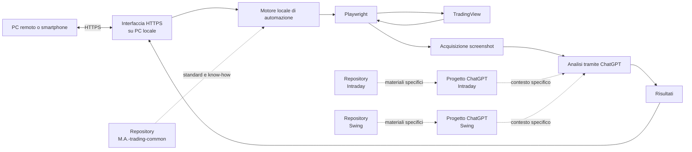

# Architettura dell'ecosistema

## Scopo e confini

Questo documento descrive i componenti conosciuti e le loro responsabilità, senza definire dettagli implementativi non ancora verificati. La logica di strategia rimane separata dall'infrastruttura comune.

## Livelli

1. **Progetti ChatGPT Intraday e Swing** — contengono il contesto di lavoro, le metodologie e i prompt specifici delle rispettive strategie. Modalità esatte di configurazione e integrazione: **TBD**.
2. **Repository GitHub Intraday e Swing** — `M.A.-trading-intraday` e `M.A.-trading-swing` versionano separatamente i materiali specifici delle due metodologie. URL e struttura interna: **TBD**.
3. **Repository comune** — `M.A.-trading-common` è la fonte di verità documentale per know-how, standard e decisioni trasversali; non contiene codice dell'automazione o logica specifica di trading.
4. **PC locale** — ospita attualmente il sistema software di automazione e l'interfaccia HTTPS. Sistema operativo, collocazione del codice e modalità di distribuzione: **TBD**.
5. **Playwright** — automatizza l'interazione del sistema locale con TradingView. Linguaggio, versione, browser e configurazione: **TBD**.
6. **TradingView** — fornisce l'ambiente grafico dal quale vengono ottenute le viste degli asset. Piano, modalità di accesso e configurazione: **TBD**.
7. **Acquisizione screenshot** — il sistema locale cattura automaticamente le immagini necessarie alle analisi. Formato, dimensioni, metadati e conservazione: **TBD**.
8. **Analisi tramite ChatGPT** — gli screenshot vengono passati a ChatGPT per l'analisi. API, modello, formato della richiesta e associazione ai progetti: **TBD**.
9. **Interfaccia HTTPS** — permette di avviare analisi da remoto e consultarne i risultati. Framework, endpoint, porta, autenticazione e protocollo interno: **TBD**.
10. **Dispositivi remoti** — PC remoti e smartphone accedono all'interfaccia per lanciare le analisi e vedere i risultati. Browser supportati e requisiti di rete: **TBD**.

## Flusso generale

Il diagramma rappresenta responsabilità e flusso concettuale, non protocolli interni o dipendenze implementative. In particolare, il modo in cui progetti e repository alimentano l'analisi o il sistema locale è **TBD**.

## Confini di responsabilità

- **Livello strategia:** progetti e repository Intraday/Swing definiscono metodologie, prompt e logica propri.
- **Livello comune documentale:** questa repository definisce riferimenti trasversali e registra le decisioni.
- **Livello infrastrutturale locale:** automazione, acquisizione, invio all'analisi e interfaccia vengono eseguiti sul PC locale, ma il relativo codice non è incluso qui.
- **Servizi esterni e accesso remoto:** TradingView e ChatGPT partecipano al flusso; i dispositivi remoti interagiscono attraverso l'interfaccia HTTPS.

Vedere anche [AUTOMATION.md](AUTOMATION.md), [INTERFACE.md](INTERFACE.md) e [DECISIONS.md](DECISIONS.md).
